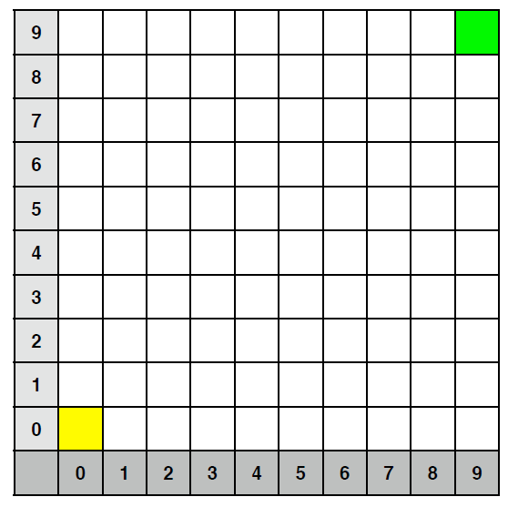

##Will Skippy Get Home?

Consider a grid (10x10 for instance).  A lost, blind kangaroo starts in position (0,0), shaded
yellow and is trying to get home, which happens to be at cell (9,9), shaded green. Skippy’s strategy to find his way home is to take random hops either North, South, East or West without exiting the grid of course. 
The question is, will this strategy get Skippy home, or will he hop around the grid forever? 

The purpose of this assignment is to simulate the process and hence illustrate that Skippy gets home eventually. 

However, you must use an object-oriented approach as described below. 

Program Design
Use the following classes and indicative set of methods (use more/different methods if you wish, vary names if you wish): 

class Dice
Represents a 4-sided dice and has these methods:
throw: return one of north, south, east, west with equal probability
stats: return hash table describing the percentage of throws in each direction so far, e.g,
       {north=>35, south=>42, east => 40 west=>39}

class Point
Represents a point in the grid. Provides these methods:
== compare two points for equality

class Kangaroo
Represents the kangaroo in the simulation. Instance variables include his location, which is initially (0,0). Provides these methods:
hop: take a random hop in one direction
at_home(): return true iff at home
move (direction) move kangaroo in the given direction 

class Grid
Represents the grid that Skippy is hopping about on. 
One key method:
lies_outside(point): return true iff given point is outside grid 

Each class should be put in a file on its own, e.g., the class Kangaroo should be in a file called kangaroo.java

Your solution 
- Instantiates the Kangaroo and Grid classes;
- Starts and runs the simulation;
- Prints the final report, including dice statistics.
Assume the South-West of the space is (0,0) and that the grid is a square. 
Your solution should work for a grid of any size. Assume Skippy starts at (0,0) and that home is the
North-East of the space at (dimension-1, dimension-1). !
Input/Output Specifications 
Input: Dimension of the grid. Integer, greater than or equal to 1. Check this on input. 
Output:
A sample program execution for a grid of dimension 3 is given on the next page (dice stats are for example only). Your program should produce output in this format. 

Sample Program Execution: 
Enter dimension of the Grid (>=1):
3!
Hopped to: (0, 1)!
Oops, hit the boundary: (-1, 1)!
Oops, hit the boundary: (-1, 1)!
Hopped to: (0, 0)!
Oops, hit the boundary: (-1, 0)!
Hopped to: (1, 0)!
Hopped to: (0, 0)!
Oops, hit the boundary: (0, -1)!
Hopped to: (1, 0)!
Oops, hit the boundary: (1, -1)!
Hopped to: (0, 0)!
Oops, hit the boundary: (0, -1)!
Oops, hit the boundary: (-1, 0)!
Hopped to: (0, 1)!
Hopped to: (0, 0)!
Oops, hit the boundary: (-1, 0)!
Hopped to: (1, 0)!
Hopped to: (0, 0)!
Hopped to: (0, 1)!
Hopped to: (0, 0)!
Hopped to: (1, 0)!
Oops, hit the boundary: (1, -1)!
Hopped to: (2, 0)!
Hopped to: (1, 0)!
Hopped to: (0, 0)!
Hopped to: (0, 1)!
Hopped to: (0, 0)!
Hopped to: (1, 0)!
Hopped to: (2, 0)!
Hopped to: (1, 0)!
Hopped to: (2, 0)!
Hopped to: (2, 1)!
Hopped to: (1, 1)!
Hopped to: (1, 2)!
Hopped to: (0, 2)!
Oops, hit the boundary: (-1, 2)!
Oops, hit the boundary: (0, 3)!
Hopped to: (1, 2)!
Hopped to: (0, 2)!
Oops, hit the boundary: (-1, 2)!
Hopped to: (1, 2)!
Hopped to: (2, 2)!
Finished in 30 hops!!
Die statistics:
Total # throws: 43
North: 26% South: 24% East: 25% West: 25% 
